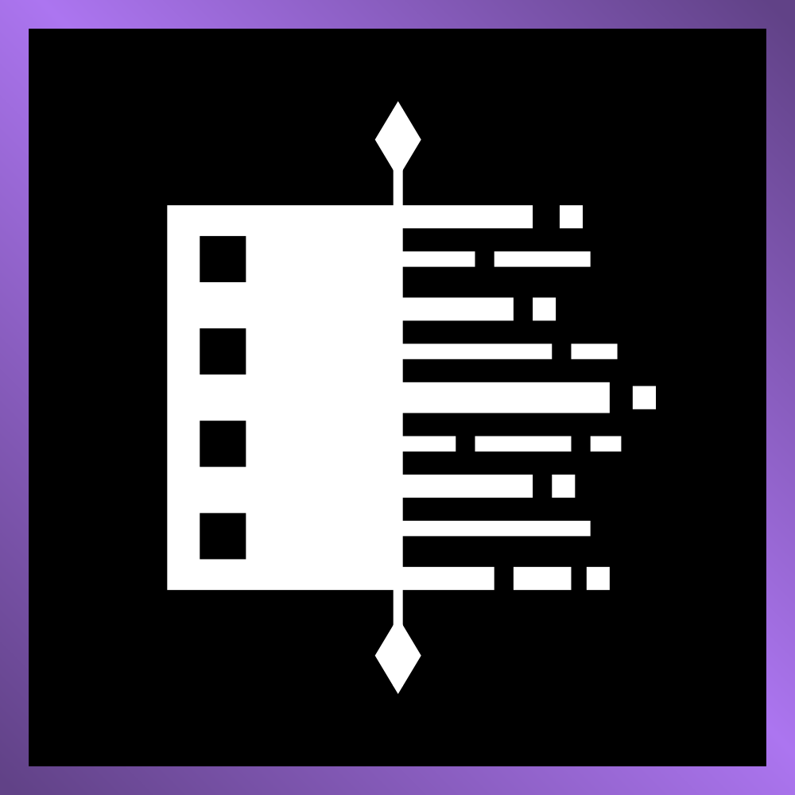
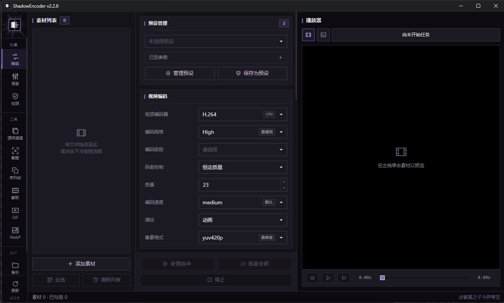
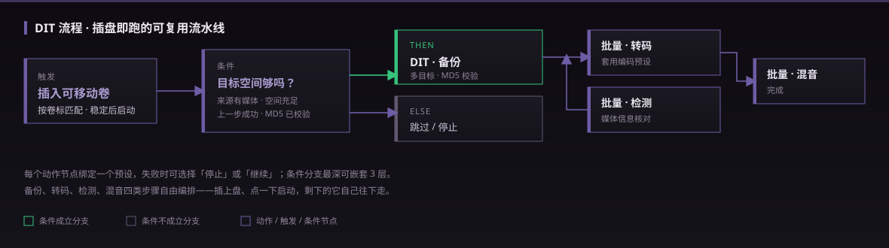

<p align="center">
  
</p>

<h1 align="center">ShadowEncoder</h1>

<p align="center">把素材丢进来，拿到想要的结果就走。一个窗口，一整套媒体处理流程。</p>

<p align="center">
  <a href="https://github.com/AngleNaris/ShadowEncoder/releases/latest"></a>
  <a href="./LICENSE"></a>
  
  
</p>

<p align="center">
  <a href="https://github.com/AngleNaris/ShadowEncoder/releases/tag/v2.2.7"><strong>下载 v2.2.7</strong></a>
  &nbsp;·&nbsp;
  <a href="#这是什么">产品能力</a>
  &nbsp;·&nbsp;
  <a href="./docs/agent-cli-design.md">Agent CLI</a>
  &nbsp;·&nbsp;
  <a href="./CONTRIBUTING.md">参与贡献</a>
</p>

<p align="center">
  
</p>

---

## 这是什么

ShadowEncoder 是一个 Windows 桌面应用，把日常做视频时那些零散的小工具收进了一个界面里。转码、截取片段、导出 GIF 和 WebP、处理透明通道、混音、媒体检测，还有一个原生播放器——以前你可能要在好几个软件之间来回切，现在它们都在同一扇窗口里，共用同一份素材列表。

界面分成左中右三栏：左边是素材列表，中间管预设和编码参数，右边直接预览。整套配色走的是「黑底 · 低饱和紫 · 零圆角」的硬朗风格，截图里看到的是转码页，其它功能在左侧导航栏切换。

<table>
  <tr>
    <td width="33%" valign="top"><b>🎬 转码</b><br><sub>H.264 / H.265 / AV1 等编码器，CRF 或码率控制，2-pass、调优风格、缩放，参数一栏可调。</sub></td>
    <td width="33%" valign="top"><b>🖼️ GIF · WebP</b><br><sub>内置 Gifski，RGBA 帧管线，透明保真，三档压缩策略，失败自动回退 FFmpeg。</sub></td>
    <td width="33%" valign="top"><b>🎚️ 混音 · 检测</b><br><sub>多轨混音、媒体信息检测，与其它功能共用同一份素材队列。</sub></td>
  </tr>
  <tr>
    <td valign="top"><b>✂️ 截取 · 截图 · 透明通道</b><br><sub>时间轴取片段、导出帧、Alpha 通道处理，播放器里直接框选裁剪区。</sub></td>
    <td valign="top"><b>💾 DIT 备份</b><br><sub>多目标拷贝、MD5 校验、媒体过滤、目录结构与命名冲突全可控。</sub></td>
    <td valign="top"><b>🤖 Agent CLI</b><br><sub>AI 和 GUI 读写同一份状态，逐字段改动，20 步可撤回。</sub></td>
  </tr>
</table>

## 预设：把一套参数存下来，下次一键套上

几乎每个功能页都接了同一套预设系统——转码、混音、检测、透明通道、截图、序列帧、截取、GIF、WebP、DIT 备份、DIT 流程，一共十一类，各自独立管理。

- **存的是整套参数**。比如一个转码预设，封装、编码器、CRF、帧率、音频码率、缩放、调优风格这些字段会一起存下来，下次从下拉框选中就全部套用，不用一个个重填。
- **管理弹窗里能看清每一项**。左边是预设列表（可拖动排序），右边一栏编辑、一栏实时汇总当前选了哪些参数，改哪一项、值是多少一目了然。
- **可以导入导出**。预设能导出成文件带走或分享，也能从文件导入，换台机器不用从头配。
- **改动带版本号**。每个预设有 revision，被流程引用时能感知「你用的预设是不是已经变了」，避免流程悄悄跑了旧参数。

## DIT 流程：插上盘，剩下的它自己往下走

如果你的活儿是重复的——插盘、备份、转码、检测——可以用「流程」把这些步骤串成一条可复用的流水线。它不是简单的顺序执行，而是带条件判断的。

<p align="center">
  
</p>

- **触发方式**：手动启动，或者监听「插入可移动卷」——按卷标关键字匹配，卷挂载稳定几秒后自动开跑。
- **四类动作**：DIT 备份、批量转码、批量混音、批量检测。每个动作节点绑定一个你存好的预设。
- **条件分支**：可以插入判断节点，比如「来源里确实有媒体文件」「备份预设的所有目标空间都够（可留百分比余量）」「上一步执行成功」「上一个备份已通过 MD5 校验」，成立走一条路，不成立走另一条，最深能嵌套 3 层。
- **失败策略**：每个动作可以单独设成失败时「停止」整条流程，或者「继续」往下走。

简单说：备份靠的是 MD5 校验，不是运气；每份素材都清楚地知道去了哪，而且拷完有据可查。

## 做 GIF，体积能小下来，透明也不会花

内置了 [Gifski](https://gif.ski/) 1.34.0（静态编译进主程序，不用另外装）。它走的是 RGBA 帧管线，所以带透明通道的素材导出后透明像素能保留干净。压缩这块给了三档可选：智能压缩、体积优先、极限压缩，看你更在意画质还是文件大小。

万一 Gifski 处理不了某个素材，程序会自动切到 FFmpeg 的调色板编码接着做，你不用停下来重新配一遍。

## AI 能上手操作，但你始终看得到它在做什么

程序自带一个 `shadowencoder-cli`，让 AI Agent 和图形界面读写的是同一份状态——不是各干各的。它的设计比较克制：每条命令只改一个字段或一个列表项，最近 20 步操作可以撤回（而且能感知冲突），任务进行中你随时能查看进度或者直接中止。

CLI 是 ShadowEncoder 的 Agent 控制端，不是独立编码器。除 `help` 和版本查询外，使用 CLI 时必须先运行同版本的 ShadowEncoder。

```text
shadowencoder-cli help
```

完整的能力说明都写在 CLI 里了。没有藏着掖着的批量改动，不会静默覆盖你的东西，也不存在绕过界面的暗门。

## 下载哪个版本

| 文件 | 适合谁 |
| --- | --- |
| `ShadowEncoder_2.2.7_x64-portable.exe` | 单文件便携版，图省事的话选它——ShadowEncoder、Gifski、FFmpeg、FFprobe、libmpv 和 CLI 全打包在里面了 |
| `ShadowEncoder_2.2.7_x64-setup.exe` | 常规的 Windows 安装程序 |
| `ShadowEncoder_2.2.7_x64_en-US.msi` | 走 Windows Installer 部署时用 |

便携版启动时会把运行时静默解到临时目录，程序退出后自动清理，不会在系统里留下一堆东西。WebView2 用的是 Windows 10/11 自带的系统运行时（Tauri 需要它）。

需要提醒的是，安装包目前**没有签名**——请只从官方 Release 页面下载，并对照 `SHA256SUMS.txt` 校验一下再运行。

## 自己构建

先把这些准备好：Node.js 18+、Rust stable、Visual Studio 2022 Build Tools、FFmpeg 9.0，以及 64 位的 libmpv。将 gyan.dev 的 Windows 64 位 essentials 构建中的 `ffmpeg.exe` 和 `ffprobe.exe` 放进 `ffmpeg/win/`，mpv 开发包放进 `mpv/win/64/`。打包脚本会拒绝非 FFmpeg 9.x 的输入。版本来源、校验值和 AI/DNN 能力边界见 [`docs/ffmpeg.md`](./docs/ffmpeg.md)。

```powershell
cd app
npm install
npm test
npm run package:portable
```

`package:portable` 会依次编译 CLI、前端和 Tauri 的 Windows bundle，最后调用 NSIS 打成单文件便携版。第一次跑 Tauri NSIS 构建时它会自己准备 `makensis`；如果你想用自己的那份，设个 `MAKENSIS` 环境变量指过去就行。

## 许可

ShadowEncoder 基于 [AGPL-3.0-or-later](./LICENSE)。需要说明的是：你的媒体产物不会仅仅因为经过 ShadowEncoder 处理就被 AGPL 约束。

贡献代码请看 [CLA](./CLA.md) 和[贡献指南](./CONTRIBUTING.md)。第三方组件和分发相关的注意事项都整理在 [THIRD_PARTY_NOTICES.md](./THIRD_PARTY_NOTICES.md)。
