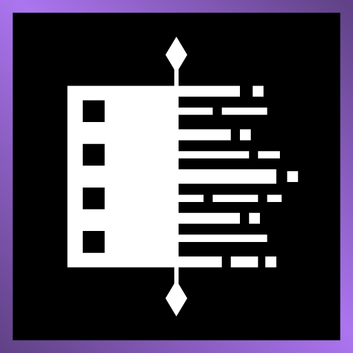
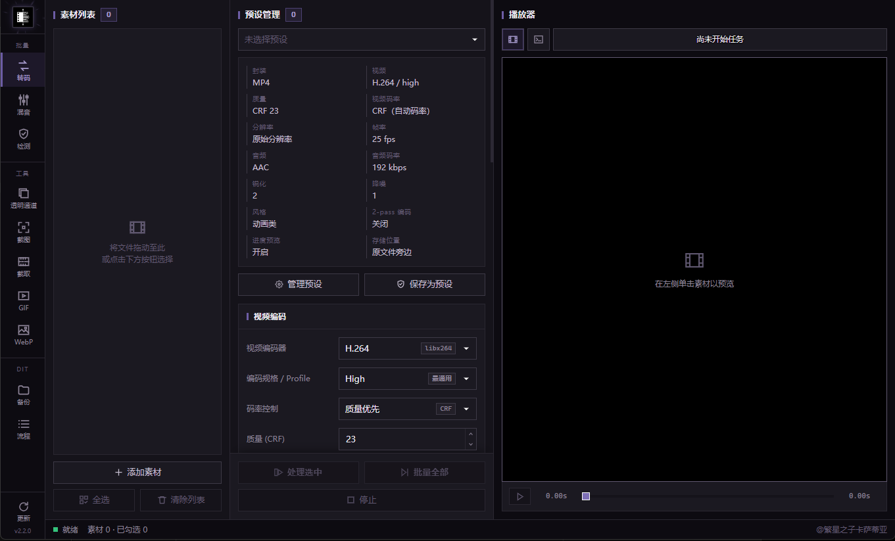

<p align="center">
  
</p>

<h1 align="center">ShadowEncoder</h1>

<p align="center">把素材丢进来，拿到想要的结果就走。一个窗口，一整套媒体处理流程。</p>

<p align="center">
  <a href="https://github.com/AngleNaris/ShadowEncoder/releases/latest"></a>
  <a href="./LICENSE"></a>
  
</p>

<p align="center">
  <a href="https://github.com/AngleNaris/ShadowEncoder/releases/tag/v2.2.0"><strong>下载 v2.2.0</strong></a>
  ·
  <a href="./docs/agent-cli-design.md">Agent CLI</a>
  ·
  <a href="./CONTRIBUTING.md">参与贡献</a>
</p>

<p align="center">
  
</p>

## 这是什么

ShadowEncoder 是一个 Windows 桌面应用，把日常做视频时那些零散的小工具收进了一个界面里。转码、截取片段、导出 GIF 和 WebP、处理透明通道、混音、媒体检测，还有一个原生播放器——以前你可能要在好几个软件之间来回切，现在它们都在同一扇窗口里，共用同一份素材列表。

界面分成左中右三栏：左边是素材列表，中间管预设和编码参数，右边直接预览。截图里看到的是转码页，其它功能在左侧的导航栏切换。

## 做 GIF，体积能小下来，透明也不会花

内置了 [Gifski](https://gif.ski/) 1.34.0（静态编译进主程序，不用另外装）。它走的是 RGBA 帧管线，所以带透明通道的素材导出后透明像素能保留干净。压缩这块给了三档可选：智能压缩、体积优先、极限压缩，看你更在意画质还是文件大小。

万一 Gifski 处理不了某个素材，程序会自动切到 FFmpeg 的调色板编码接着做，你不用停下来重新配一遍。

## 备份靠的是校验，不是运气

DIT 备份支持一次拷到多个目标、按媒体类型过滤、MD5 校验、控制目录结构，同名文件冲突也有对应的处理方式。简单说，每份素材都清楚地知道去了哪，而且拷完有据可查。

如果你的活儿是重复的，可以用「流程」功能把备份、转码、检测、混音这些步骤串成一套可复用的流水线。插上盘、点一下启动，剩下的它自己往下走。

## AI 能上手操作，但你始终看得到它在做什么

程序自带一个 `shadowencoder-cli`，让 AI Agent 和图形界面读写的是同一份状态——不是各干各的。它的设计比较克制：每条命令只改一个字段或一个列表项，最近 20 步操作可以撤回（而且能感知冲突），任务进行中你随时能查看进度或者直接中止。

```text
shadowencoder-cli help
```

完整的能力说明都写在 CLI 里了。没有藏着掖着的批量改动，不会静默覆盖你的东西，也不存在绕过界面的暗门。

## 下载哪个版本

| 文件 | 适合谁 |
| --- | --- |
| `ShadowEncoder_2.2.0_x64-portable.exe` | 单文件便携版，图省事的话选它——ShadowEncoder、Gifski、FFmpeg、FFprobe、libmpv 和 CLI 全打包在里面了 |
| `ShadowEncoder_2.2.0_x64-setup.exe` | 常规的 Windows 安装程序 |
| `ShadowEncoder_2.2.0_x64_en-US.msi` | 走 Windows Installer 部署时用 |

便携版启动时会把运行时静默解到临时目录，程序退出后自动清理，不会在系统里留下一堆东西。WebView2 用的是 Windows 10/11 自带的系统运行时（Tauri 需要它）。

需要提醒的是，安装包目前**没有签名**——请只从官方 Release 页面下载，并对照 `SHA256SUMS.txt` 校验一下再运行。

## 自己构建

先把这些准备好：Node.js 18+、Rust stable、Visual Studio 2022 Build Tools、FFmpeg，以及 64 位的 libmpv。然后把 FFmpeg 放进 `ffmpeg/win/`，mpv 开发包放进 `mpv/win/64/`。

```powershell
cd app
npm install
npm test
npm run package:portable
```

`package:portable` 会依次编译 CLI、前端和 Tauri 的 Windows bundle，最后调用 NSIS 打成单文件便携版。第一次跑 Tauri NSIS 构建时它会自己准备 `makensis`；如果你想用自己的那份，设个 `MAKENSIS` 环境变量指过去就行。

## 许可

ShadowEncoder 基于 [AGPL-3.0-or-later](./LICENSE)。需要说明的是：你的媒体产物不会仅仅因为经过 ShadowEncoder 处理就被 AGPL 约束。

贡献代码请看 [CLA](./CLA.md) 和[贡献指南](./CONTRIBUTING.md)。第三方组件和分发相关的注意事项都整理在 [THIRD_PARTY_NOTICES.md](./THIRD_PARTY_NOTICES.md)。
