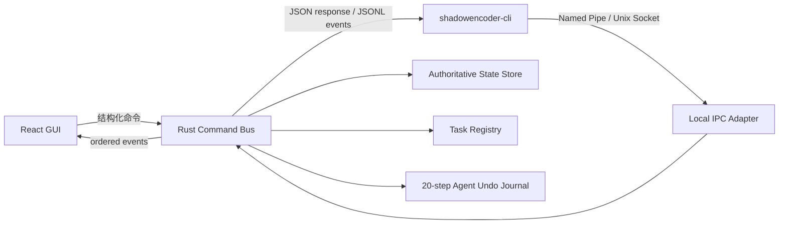

# ShadowEncoder Agent CLI 设计

状态：规划完成，尚未实现

## 1. 目标与约束

Agent CLI 需要满足以下产品目标：

1. AI Agent 与用户可同时操作同一个已启动的 ShadowEncoder 实例。
2. CLI 的修改立即反映到 GUI，用户能看到操作来源、目标和结果，并可继续手动操作。
3. AI 允许执行的每个操作都必须能通过 CLI 撤回，后端保留最近 20 步 AI 操作。
4. AI 修改配置时一次只能修改一个字段或一个列表项，不提供批量修改、JSON Patch、整份配置覆盖或批量导入。
5. `shadowencoder-cli help` 输出完整、可直接提供给 Agent 的 Skill Markdown，而不是简略命令摘要。
6. CLI 不开放网络端口，不允许任意 shell 或任意 FFmpeg 参数注入。
7. 新安装的应用没有任何预设；CLI 也不会隐式创建演示预设。

本设计不负责开机启动或常驻系统服务。只有用户启动 ShadowEncoder 后，Agent CLI 才能操作当前应用实例。

## 2. 问题审查

当前预设由 React Context 和 `localStorage` 持有，素材列表与任务状态也主要位于前端内存。若 CLI 直接读写 `localStorage`，会出现以下问题：

- GUI 与 CLI 最后写入者覆盖前一方，无法可靠并发。
- CLI 进程执行完即退出，20 步撤回历史会丢失。
- 前端自增的 `revision` 不是原子比较交换，不能阻止旧数据覆盖新数据。
- AI 的修改无法通过统一事件实时显示在 GUI。
- 后端任务仍按 Tauri 窗口管理，CLI 无法稳定复用前端任务状态。

因此，CLI 不能成为第二套状态系统，也不能直接操作 WebView 存储。

## 3. 方案比较

### 方案 A：CLI 直接修改前端存储

实现成本最低，但无法保证并发、撤回和 GUI 实时同步。拒绝采用。

### 方案 B：GUI 进程作为状态与命令服务

ShadowEncoder 启动后建立仅当前用户可访问的本机 IPC。GUI 与 CLI 的所有写操作进入同一条后端命令总线，由后端串行提交、递增 revision、记录撤回信息并广播事件。

优点：

- 不需要常驻服务，符合“应用启动后才启用”的要求。
- GUI 与 CLI 共享同一份状态和任务注册表。
- 可以原子实现冲突检查、20 步撤回和事件广播。
- 改造范围可分阶段控制。

限制：应用未启动时，除 `help`、`--version` 外的命令返回 `APP_NOT_RUNNING`。

### 方案 C：独立常驻守护进程

能够脱离 GUI 执行任务，但引入服务生命周期、自动启动、升级和孤儿进程问题。当前需求明确不需要，暂不采用。

结论：第一版采用方案 B，并保留未来把状态服务抽成独立进程的接口边界。

## 4. 推荐架构



### 4.1 Rust 模块边界

建议逐步把当前单文件后端拆为：

```text
src/
  main.rs                 Tauri GUI 入口与窗口事件适配
  lib.rs                  共享模块入口
  command_bus.rs          命令校验、串行提交、revision 与事件
  state_store.rs          SQLite 持久化与旧前端数据迁移
  operation_journal.rs    20 步 Agent 撤回日志
  task_registry.rs        任务状态、进度、取消与输出清单
  ipc/
    mod.rs                传输抽象
    windows_pipe.rs       Windows Named Pipe
    unix_socket.rs        Linux/macOS Unix Domain Socket
  bin/
    shadowencoder-cli.rs  CLI 参数解析、IPC 客户端与 help
```

现有 `#[tauri::command]` 只负责把 GUI 请求适配到共享命令模型；CLI 不直接调用带 `tauri::Window` 的函数。

### 4.2 IPC

- Windows：`\\.\pipe\shadowencoder-{current-user-sid}`。
- Linux/macOS：应用数据目录中的 Unix Domain Socket。
- 服务端只在 GUI 进程生命周期内存在。
- Windows Pipe ACL 与 Unix Socket 权限均限制为当前用户。
- 每条消息有协议版本、最大长度、请求 ID 和结构化 JSON Schema。
- 不接收 shell 字符串，不开放 TCP/HTTP 端口。

### 4.3 唯一状态源

后端成为以下数据的唯一写入者：

- 预设与每个预设的 revision。
- 素材队列、选择状态与排序。
- 页面可持久化配置。
- 工作流定义。
- 任务注册表、进度、日志与输出清单。
- Agent 操作历史。

建议使用应用数据目录中的 SQLite 数据库。单次命令在一个事务中完成：校验 revision、修改状态、写入操作日志、递增全局序列号。SQLite 比整份 JSON 覆盖更适合并发、撤回和崩溃恢复。

迁移时由前端一次性读取现有 `shadowencoder.presets.v2`，调用只允许执行一次的内部迁移命令。迁移接口不暴露给 Agent CLI，因此不违反 CLI 禁止批量配置的约束。迁移完成后前端停止写 `localStorage`。

## 5. 命令协议

每个写请求至少包含：

```json
{
  "protocolVersion": 1,
  "requestId": "uuid",
  "actor": "agent",
  "sessionId": "uuid",
  "expectedRevision": 12,
  "command": {
    "type": "preset.set_field",
    "presetId": "preset-id",
    "field": "crf",
    "value": 20
  }
}
```

成功响应至少包含：

```json
{
  "ok": true,
  "operationId": "uuid",
  "sequence": 1042,
  "entityRevision": 13,
  "reversible": true,
  "summary": "将预设 A 的 crf 从 23 修改为 20"
}
```

同一个 `requestId` 重试必须幂等，不能重复执行操作。

## 6. CLI 命令面

### 6.1 只读命令

```text
shadowencoder-cli help
shadowencoder-cli help command <command>
shadowencoder-cli --version
shadowencoder-cli status --json
shadowencoder-cli watch --jsonl [--after <sequence>]
shadowencoder-cli schema list --json
shadowencoder-cli schema show <function> --json
shadowencoder-cli preset list [--type <type>] --json
shadowencoder-cli preset show <preset-id> --json
shadowencoder-cli source list --json
shadowencoder-cli task list --json
shadowencoder-cli task show <task-id> --json
shadowencoder-cli history list --json
```

### 6.2 单项状态修改

```text
shadowencoder-cli preset create --type <type> --name <name>
shadowencoder-cli preset rename <preset-id> <name> --revision <n>
shadowencoder-cli preset set <preset-id> <field> <value> --revision <n>
shadowencoder-cli preset item-add <preset-id> <field> <value> --revision <n>
shadowencoder-cli preset item-remove <preset-id> <field> <item-id> --revision <n>
shadowencoder-cli preset delete <preset-id> --revision <n>

shadowencoder-cli source add <path>
shadowencoder-cli source remove <source-id> --revision <n>
shadowencoder-cli source select <source-id> --revision <n>
shadowencoder-cli source unselect <source-id> --revision <n>

shadowencoder-cli preset create --type workflow --name <name>
shadowencoder-cli workflow node-add <workflow-id> <kind> --revision <n>
shadowencoder-cli workflow node-set <workflow-id> <node-id> <field> <value> --revision <n>
shadowencoder-cli workflow node-remove <workflow-id> <node-id> --revision <n>
shadowencoder-cli workflow edge-add <workflow-id> <source> <source-port> <target> <target-port> --revision <n>
shadowencoder-cli workflow edge-remove <workflow-id> <edge-id> --revision <n>
```

数组字段只能通过 `item-add` 或 `item-remove` 一项一项修改。服务端拒绝整个数组替换。

明确不提供：

- `set-many`、`bulk-*`、`--patch`、`--config-file`。
- 一条命令设置多个字段。
- CLI 预设批量导入或整份 JSON 覆盖。
- 任意 FFmpeg 参数字符串。

### 6.3 任务命令

```text
shadowencoder-cli task start <function> --preset <preset-id> --scope selected --revision <n>
shadowencoder-cli task cancel <task-id>
```

任务读取当前 GUI 素材列表及选中状态。CLI 不接受一组临时文件路径，AI 必须先逐项调用 `source add`，用户能同步看到队列变化。

AI 第一版允许的任务必须满足可撤回条件：

- 输出冲突策略只能是“失败”或“生成唯一新名称”，禁止覆盖现有文件。
- 转码、混音、截图、GIF、WebP、截取和备份复制记录所有新建输出及完成时哈希。
- 检测任务记录结果实体，不改动源文件。
- DIT 移动、删除源文件和覆盖目标文件不向 Agent CLI 开放。

运行中撤回任务等价于取消；完成后撤回会先校验输出仍是本任务创建且哈希未变化，再一次性移除这些输出。任一输出不满足校验时，整次撤回拒绝，避免部分回滚。

## 7. 20 步撤回

### 7.1 范围

- 只记录 `actor=agent` 且成功提交的操作。
- 全局保留最近 20 个未过期操作，CLI 重启和 GUI 重启后仍可用。
- GUI 用户操作会产生事件和 revision，但不占用 Agent 的 20 步容量。
- 不提供多步撤回参数；每次只能撤回一步。

命令：

```text
shadowencoder-cli undo
shadowencoder-cli history list --json
```

`undo` 默认只撤回当前 Agent session 的最后一个未撤回操作，并返回新的 operation ID 和 revision。

### 7.2 操作记录

每条记录包含：

- `operationId`、`sessionId`、顺序号和时间。
- 命令类型与目标实体/字段。
- 修改前值、修改后值和逆操作。
- 操作完成后的字段值或实体 revision 守卫。
- 任务输出清单、所有权与哈希（仅任务操作）。
- 状态：`applied`、`undone`、`expired`。

### 7.3 冲突规则

- 字段修改：只有当前字段仍等于该操作写入的值时才能撤回。
- 列表修改：只有目标列表项仍存在且身份未变化时才能撤回添加；撤回删除则要求 item ID 未被复用。
- 新建预设：只有预设在创建后未被其他操作改变时才能删除。
- 删除预设：只有原 ID 未被重新占用时才能恢复完整快照。
- 已完成任务：只有所有本任务拥有的输出仍存在且哈希一致时才能移除。

用户后来修改同一目标时返回 `UNDO_CONFLICT`，绝不覆盖用户的新值。用户只修改了同一预设的其他字段时，不应阻止字段级撤回。

## 8. GUI 协作体验

后端每次提交后广播有序事件：

```json
{
  "sequence": 1042,
  "actor": "agent",
  "sessionId": "uuid",
  "operationId": "uuid",
  "kind": "preset.set_field",
  "target": "preset/preset-id/crf",
  "summary": "crf: 23 -> 20"
}
```

GUI 行为：

- 立即使用后端快照更新相关控件，不维护第二份可写状态。
- AI 修改的控件短暂显示来源标记，操作同时进入统一活动/日志视图。
- 用户仍可切换页面、编辑配置、管理队列和取消任务。
- 用户正在编辑且尚未提交的同一字段收到远程更新时，保留草稿并显示冲突状态；用户提交时必须基于最新 revision。
- 事件序列断档或 IPC 重连后，GUI 重新获取完整快照再继续订阅。

## 9. 错误码

CLI 对 Agent 输出稳定的结构化错误：

| 错误码 | 含义 | Agent 动作 |
| --- | --- | --- |
| `APP_NOT_RUNNING` | GUI 未启动或 IPC 不可达 | 告知用户启动应用，不循环重试 |
| `PROTOCOL_MISMATCH` | CLI 与应用协议不兼容 | 停止修改并报告版本 |
| `VALIDATION_ERROR` | 字段、类型或值不合法 | 读取 schema 后修正单个值 |
| `REVISION_CONFLICT` | 状态已被用户或其他操作修改 | 重新 show，再决定是否提交 |
| `UNDO_CONFLICT` | 撤回会覆盖后续变化 | 停止，不强制覆盖 |
| `HISTORY_EMPTY` | 没有可撤回的 Agent 操作 | 不再重试 |
| `TASK_BUSY` | 当前任务策略不允许新任务 | 等待或请用户取消 |
| `DESTRUCTIVE_COMMAND_DENIED` | Agent 请求了移动、覆盖或删除源文件 | 改用非破坏方案 |
| `OUTPUT_CHANGED` | 任务输出已被用户修改 | 拒绝删除输出 |
| `PERMISSION_DENIED` | IPC 或文件权限不足 | 报告准确路径与权限问题 |

## 10. 分发

CLI 作为独立的 `app/agent-cli` Cargo crate 构建，避免继承 GUI/libmpv 的原生链接依赖。`npm run build:cli` 会按当前目标三元组构建并暂存 sidecar；Tauri Windows 配置通过 `bundle.externalBin` 把匹配版本的 `shadowencoder-cli` 放入分发包。生成的 EXE 是构建产物，不提交到仓库。安装包可选择把 CLI 目录加入当前用户 PATH；便携版 Skill 使用绝对路径或应用同目录路径。

完整 Skill Markdown 作为 Rust `include_str!` 资源编译进 CLI。`help` 在应用未运行时也必须可用，并输出与当前 CLI 协议版本完全对应的文本。CI 对 Skill 中列出的每条命令执行解析器契约测试，防止帮助文档漂移。

## 11. 实施阶段

### 阶段 1：共享状态与命令模型

- 引入后端状态库和 SQLite schema。
- 把预设从 `localStorage` 迁移到后端。
- GUI 的预设增删改改走命令总线。
- 保持 fresh install 空预设。

### 阶段 2：revision、事件与 20 步撤回

- 实现全局 sequence、实体 revision 和幂等 request ID。
- 实现字段级逆操作与 20 条持久化 Agent 日志。
- GUI 接入有序状态事件和 AI 来源显示。

### 阶段 3：本机 IPC 与 CLI

- Windows Named Pipe 与 Unix Domain Socket。
- 第二 binary、结构化命令、JSON/JSONL 输出。
- current-user ACL、协议握手和消息限制。

### 阶段 4：任务注册表与可撤回输出

- 把前端任务状态迁移到后端 task registry。
- 支持 GUI/CLI 查看、订阅、取消任务。
- 记录新建输出清单与哈希。
- 开放非破坏任务，拒绝 DIT 移动和覆盖。

### 阶段 5：Skill、打包与回归

- 将附录 Skill 编译进 `help`。
- 安装包与便携包包含匹配版本的 CLI。
- 完成并发、冲突、撤回、断线恢复和真实打包测试。

## 12. 验收测试

至少覆盖：

1. fresh install 中所有预设类型均为空。
2. GUI 修改字段后，旧 revision 的 CLI 修改返回 `REVISION_CONFLICT`。
3. CLI 修改一个字段，GUI 在同一事件序列中更新并显示 Agent 来源。
4. CLI 无法通过任何参数一次修改两个字段或替换整个数组。
5. 连续 21 个 Agent 操作后，只有最近 20 个可撤回。
6. 用户修改了同一字段后，Agent undo 返回 `UNDO_CONFLICT`。
7. 用户修改了同一预设的其他字段时，字段级 undo 仍可执行。
8. 重复发送相同 request ID 不会执行两次。
9. IPC 断开重连后，GUI/CLI 通过 sequence 补齐或重新抓取快照。
10. 运行中 task undo 会取消任务。
11. 完成任务的未修改输出可撤回；任一输出哈希变化时整次撤回拒绝。
12. Agent CLI 无法启动 DIT move、覆盖或删除源文件。
13. 非当前用户无法连接 IPC。
14. `help` 在 GUI 未启动时仍输出完整 Skill，且 Skill 中所有命令均能被解析器识别。
15. 安装版与便携版都能从分发目录调用匹配版本的 CLI。

## 附录 A：`shadowencoder-cli help` 完整 Skill 草案

以下内容应作为独立 Markdown 资源编译进 CLI，并由 `help` 原样输出。

```markdown
---
name: shadowencoder-cli
description: Use the local ShadowEncoder application through its reversible, user-visible Agent CLI. Use for inspecting media queues, editing presets one field at a time, composing workflow steps, starting supported non-destructive jobs, monitoring progress, and undoing the latest Agent operation.
version: 1
---

# ShadowEncoder Agent CLI

Use `shadowencoder-cli` only to collaborate with a user in an already running ShadowEncoder application. The GUI remains visible and interactive. Every successful command is reflected in the GUI and labeled as an Agent operation.

## Mandatory Rules

1. Run `shadowencoder-cli status --json` before the first operation.
2. Read the target with `show --json` before changing it. Use the returned revision in the write command.
3. Change exactly one field, one list item, one source, or one workflow step per command.
4. Never search for or use batch, patch, import, whole-object replacement, arbitrary FFmpeg argument, shell, overwrite, source deletion, or DIT move behavior. These capabilities are intentionally unavailable.
5. After every write, inspect the response and retain its `operationId`, `sequence`, and new revision.
6. On `REVISION_CONFLICT`, read the target again and reassess. Never retry with a guessed revision.
7. On `UNDO_CONFLICT` or `OUTPUT_CHANGED`, stop. Never force an undo over user changes.
8. Use `shadowencoder-cli undo` once per operation. There is no multi-step undo command.
9. Do not hide, suppress, or bypass GUI feedback. The user must be able to see and interrupt Agent activity.
10. Do not repeatedly retry `APP_NOT_RUNNING`; ask the user to start ShadowEncoder.

## Session Bootstrap

Run:

```text
shadowencoder-cli --version
shadowencoder-cli status --json
shadowencoder-cli schema list --json
```

Use one stable Agent session ID for the current collaboration. Pass it through the environment variable `SHADOWENCODER_AGENT_SESSION`. Generate it once if the host has not already supplied one.

## Read Commands

```text
shadowencoder-cli help
shadowencoder-cli help command <command>
shadowencoder-cli --version
shadowencoder-cli status --json
shadowencoder-cli watch --jsonl [--after <sequence>]
shadowencoder-cli schema list --json
shadowencoder-cli schema show <function> --json
shadowencoder-cli preset list [--type <type>] --json
shadowencoder-cli preset show <preset-id> --json
shadowencoder-cli source list --json
shadowencoder-cli task list --json
shadowencoder-cli task show <task-id> --json
shadowencoder-cli history list --json
```

## Preset Commands

Create one preset, then set its fields one command at a time:

```text
shadowencoder-cli preset create --type <type> --name <name>
shadowencoder-cli preset rename <preset-id> <name> --revision <n>
shadowencoder-cli preset set <preset-id> <field> <value> --revision <n>
shadowencoder-cli preset item-add <preset-id> <field> <value> --revision <n>
shadowencoder-cli preset item-remove <preset-id> <field> <item-id> --revision <n>
shadowencoder-cli preset delete <preset-id> --revision <n>
```

Never set an array with `preset set`. Use `item-add` or `item-remove` for exactly one item.

## Source Commands

```text
shadowencoder-cli source add <path>
shadowencoder-cli source remove <source-id> --revision <n>
shadowencoder-cli source select <source-id> --revision <n>
shadowencoder-cli source unselect <source-id> --revision <n>
```

Add sources one path at a time. Do not pass globs or multiple paths. A task with `--scope selected` uses the selection visible in the GUI.

## Workflow Commands

```text
shadowencoder-cli preset create --type workflow --name <name>
shadowencoder-cli workflow node-add <workflow-id> <kind> --revision <n>
shadowencoder-cli workflow node-set <workflow-id> <node-id> <field> <value> --revision <n>
shadowencoder-cli workflow node-remove <workflow-id> <node-id> --revision <n>
shadowencoder-cli workflow edge-add <workflow-id> <source> <source-port> <target> <target-port> --revision <n>
shadowencoder-cli workflow edge-remove <workflow-id> <edge-id> --revision <n>
```

Each workflow action references an existing function preset. Create or edit that preset through the preset commands first.

## Task Commands

```text
shadowencoder-cli task start <function> --preset <preset-id> --scope selected --revision <n>
shadowencoder-cli task cancel <task-id>
shadowencoder-cli task show <task-id> --json
shadowencoder-cli watch --jsonl
```

Only non-destructive tasks are available. Output must be newly created or uniquely renamed. DIT move, source deletion, and overwriting existing output are denied.

To monitor a task, use `task show` for a snapshot or `watch --jsonl` for ordered progress and log events. Do not infer completion from process exit alone; require a terminal task state.

## Undo

```text
shadowencoder-cli history list --json
shadowencoder-cli undo
```

The application keeps the latest 20 successful Agent operations. `undo` reverts only the latest eligible operation for the current Agent session.

- A running task is canceled.
- A completed task removes only unchanged outputs created by that task.
- A configuration undo restores only the field or item changed by that operation.
- User changes always win. A conflict is reported instead of overwritten.

## Required Mutation Sequence

For every configuration change:

1. `show --json` the target.
2. Confirm the field exists in `schema show`.
3. Run one write command with the exact current revision.
4. Check `ok`, `operationId`, `sequence`, and the returned revision.
5. `show --json` again when the next change depends on the result.

Example:

```text
shadowencoder-cli preset show preset-123 --json
shadowencoder-cli schema show encode --json
shadowencoder-cli preset set preset-123 crf 20 --revision 7
shadowencoder-cli preset show preset-123 --json
shadowencoder-cli preset set preset-123 preset slow --revision 8
```

The two fields are intentionally changed by two separate commands.

## Error Handling

- `APP_NOT_RUNNING`: ask the user to start ShadowEncoder; do not loop.
- `PROTOCOL_MISMATCH`: stop and report GUI and CLI versions.
- `VALIDATION_ERROR`: reread schema and correct only the rejected value.
- `REVISION_CONFLICT`: reread the target; do not force or guess.
- `UNDO_CONFLICT`: stop; a later user or Agent change would be overwritten.
- `HISTORY_EMPTY`: there is nothing to undo.
- `TASK_BUSY`: wait, or ask the user whether the visible task should be canceled.
- `DESTRUCTIVE_COMMAND_DENIED`: choose a non-destructive operation.
- `OUTPUT_CHANGED`: do not delete the modified output.
- `PERMISSION_DENIED`: report the exact resource and permission failure.

## Completion Reporting

Report to the user:

- what changed or ran;
- affected preset, source, workflow step, task, and output IDs;
- terminal task result and output paths;
- the latest reversible `operationId`;
- any conflict, denied operation, or validation that was not performed.
```
